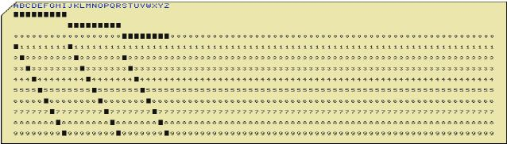

# Project Description

This is a C++ application. It uses uses STL map to decrypt the old punch card code into plain text.

The file includes the following classes:

1. PunchCardMap
2. FileIO
3. Rotation
4. CardParser
5. Converter
